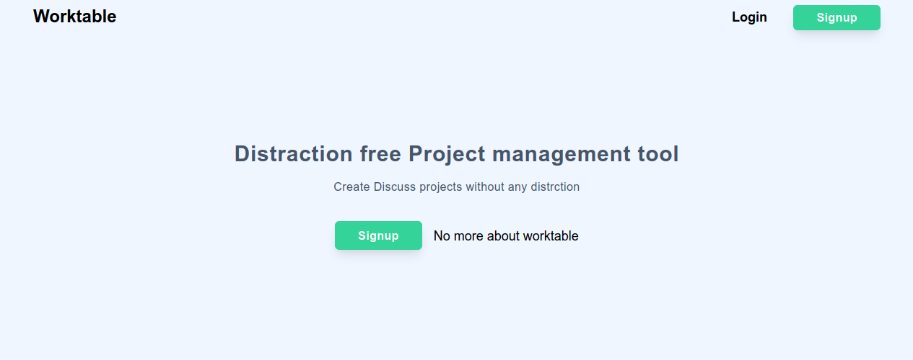

# Worktable
------
Minimal Project mangement system

> Note: Not ready for production use.

# Start project in development mode
## prerequisite
1. Docker
2. Docker compose
----------
1. Clone this project by runing git clone command  `git clone git@github.com:sagarkaurav/worktable.git`
2. After cloning the repo  `cd` into the project root directory.
3. Docker compose command will setup all the requirments. `docker-compose -f docker-compose.dev.yml up -d`
4. After docker compose setup is done  run `docker container exec -it worktable_app_1 /bin/bash` to get access into backend server. If you have changed the root directory name then the container name also get changed in that case container name will be `[root_dir_name]_app_1`
5. run inside the backend server to start pipenv enviornment `pipenv shell`
6. install backend dependencies `pipenv install`
7. run inside the backend server  `flask db migrate` to setup database tables.
8. run `flask run --host 0.0.0.0` inside the backend server to start backend service
9. Access app at `http://localhost:5000`

> In development mode all the email sent by the backend server will be available at `http://localhost:1080`

# Credits
1. All the icons used in this app is from https://heroicons.com/
2. All the illustrations used in this app is from https://undraw.co/
3. To check all the other libraries used in this project please check `Pipfile` and `package.json` file